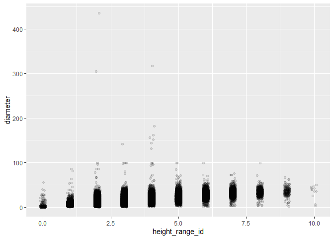
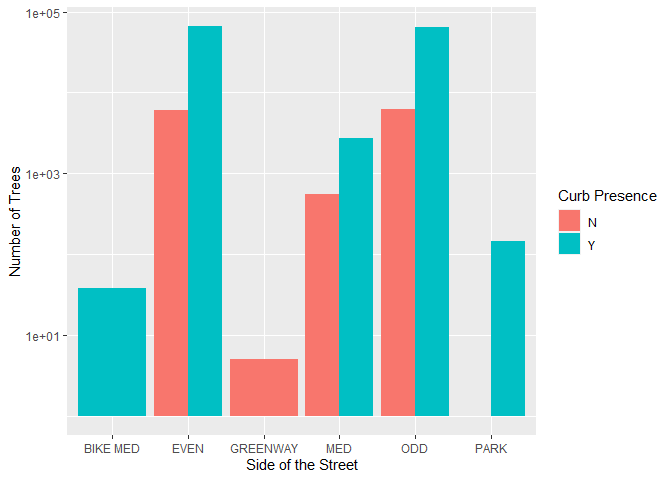
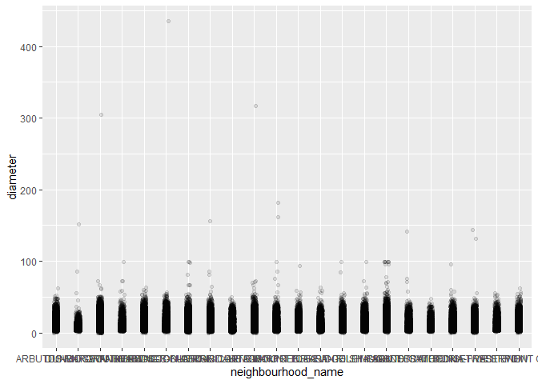

Mini Data Analysis Milestone 2
================

*To complete this milestone, you can either edit [this `.rmd`
file](https://raw.githubusercontent.com/UBC-STAT/stat545.stat.ubc.ca/master/content/mini-project/mini-project-2.Rmd)
directly. Fill in the sections that are commented out with
`<!--- start your work here--->`. When you are done, make sure to knit
to an `.md` file by changing the output in the YAML header to
`github_document`, before submitting a tagged release on canvas.*

# Welcome to the rest of your mini data analysis project!

In Milestone 1, you explored your data. and came up with research
questions. This time, we will finish up our mini data analysis and
obtain results for your data by:

- Making summary tables and graphs
- Manipulating special data types in R: factors and/or dates and times.
- Fitting a model object to your data, and extract a result.
- Reading and writing data as separate files.

We will also explore more in depth the concept of *tidy data.*

**NOTE**: The main purpose of the mini data analysis is to integrate
what you learn in class in an analysis. Although each milestone provides
a framework for you to conduct your analysis, it’s possible that you
might find the instructions too rigid for your data set. If this is the
case, you may deviate from the instructions – just make sure you’re
demonstrating a wide range of tools and techniques taught in this class.

# Instructions

**To complete this milestone**, edit [this very `.Rmd`
file](https://raw.githubusercontent.com/UBC-STAT/stat545.stat.ubc.ca/master/content/mini-project/mini-project-2.Rmd)
directly. Fill in the sections that are tagged with
`<!--- start your work here--->`.

**To submit this milestone**, make sure to knit this `.Rmd` file to an
`.md` file by changing the YAML output settings from
`output: html_document` to `output: github_document`. Commit and push
all of your work to your mini-analysis GitHub repository, and tag a
release on GitHub. Then, submit a link to your tagged release on canvas.

**Points**: This milestone is worth 50 points: 45 for your analysis, and
5 for overall reproducibility, cleanliness, and coherence of the Github
submission.

**Research Questions**: In Milestone 1, you chose two research questions
to focus on. Wherever realistic, your work in this milestone should
relate to these research questions whenever we ask for justification
behind your work. In the case that some tasks in this milestone don’t
align well with one of your research questions, feel free to discuss
your results in the context of a different research question.

# Learning Objectives

By the end of this milestone, you should:

- Understand what *tidy* data is, and how to create it using `tidyr`.
- Generate a reproducible and clear report using R Markdown.
- Manipulating special data types in R: factors and/or dates and times.
- Fitting a model object to your data, and extract a result.
- Reading and writing data as separate files.

# Setup

Begin by loading your data and the tidyverse package below:

``` r
library(datateachr) # <- might contain the data you picked!
library(tidyverse)
```

    ## Warning: package 'tidyverse' was built under R version 4.2.3

    ## Warning: package 'ggplot2' was built under R version 4.2.3

    ## Warning: package 'tibble' was built under R version 4.2.3

    ## Warning: package 'tidyr' was built under R version 4.2.3

    ## Warning: package 'readr' was built under R version 4.2.3

    ## Warning: package 'purrr' was built under R version 4.2.3

    ## Warning: package 'dplyr' was built under R version 4.2.3

    ## Warning: package 'stringr' was built under R version 4.2.3

    ## Warning: package 'forcats' was built under R version 4.2.3

    ## Warning: package 'lubridate' was built under R version 4.2.3

``` r
library(broom)
```

    ## Warning: package 'broom' was built under R version 4.2.3

``` r
library(gapminder)
```

    ## Warning: package 'gapminder' was built under R version 4.2.3

``` r
library(tsibble)
```

    ## Warning: package 'tsibble' was built under R version 4.2.3

``` r
library(testthat)
```

    ## Warning: package 'testthat' was built under R version 4.2.3

``` r
library(digest)
```

    ## Warning: package 'digest' was built under R version 4.2.3

``` r
library(ggridges)
```

    ## Warning: package 'ggridges' was built under R version 4.2.3

``` r
library(scales)
```

    ## Warning: package 'scales' was built under R version 4.2.3

``` r
library(rlang)
```

    ## Warning: package 'rlang' was built under R version 4.2.3

``` r
library(readr)
library(tidymodels)
```

    ## Warning: package 'tidymodels' was built under R version 4.2.3

    ## Warning: package 'dials' was built under R version 4.2.3

    ## Warning: package 'infer' was built under R version 4.2.3

    ## Warning: package 'modeldata' was built under R version 4.2.3

    ## Warning: package 'parsnip' was built under R version 4.2.3

    ## Warning: package 'recipes' was built under R version 4.2.3

    ## Warning: package 'rsample' was built under R version 4.2.3

    ## Warning: package 'tune' was built under R version 4.2.3

    ## Warning: package 'workflows' was built under R version 4.2.3

    ## Warning: package 'workflowsets' was built under R version 4.2.3

    ## Warning: package 'yardstick' was built under R version 4.2.3

# Task 1: Process and summarize your data

From milestone 1, you should have an idea of the basic structure of your
dataset (e.g. number of rows and columns, class types, etc.). Here, we
will start investigating your data more in-depth using various data
manipulation functions.

### 1.1 (1 point)

First, write out the 4 research questions you defined in milestone 1
were. This will guide your work through milestone 2:

<!-------------------------- Start your work below ---------------------------->

1.  How does the *height_range_id* relate to the *diameter*? For
    example, are the larger diameter trees in a taller height group?

2.  What types of species are in the neighbourhoods where UBC campus is
    located?

3.  How does *street_side_name* relate to *curb*? For example, does the
    odd numbered side of the street have more trees next to a curb than
    the even numbered side?

4.  Which neighbourhood on average has the largest trees by diameter?

<!----------------------------------------------------------------------------->

Here, we will investigate your data using various data manipulation and
graphing functions.

### 1.2 (8 points)

Now, for each of your four research questions, choose one task from
options 1-4 (summarizing), and one other task from 4-8 (graphing). You
should have 2 tasks done for each research question (8 total). Make sure
it makes sense to do them! (e.g. don’t use a numerical variables for a
task that needs a categorical variable.). Comment on why each task helps
(or doesn’t!) answer the corresponding research question.

Ensure that the output of each operation is printed!

Also make sure that you’re using dplyr and ggplot2 rather than base R.
Outside of this project, you may find that you prefer using base R
functions for certain tasks, and that’s just fine! But part of this
project is for you to practice the tools we learned in class, which is
dplyr and ggplot2.

**Summarizing:**

1.  Compute the *range*, *mean*, and *two other summary statistics* of
    **one numerical variable** across the groups of **one categorical
    variable** from your data.
2.  Compute the number of observations for at least one of your
    categorical variables. Do not use the function `table()`!
3.  Create a categorical variable with 3 or more groups from an existing
    numerical variable. You can use this new variable in the other
    tasks! *An example: age in years into “child, teen, adult, senior”.*
4.  Compute the proportion and counts in each category of one
    categorical variable across the groups of another categorical
    variable from your data. Do not use the function `table()`!

**Graphing:**

6.  Create a graph of your choosing, make one of the axes logarithmic,
    and format the axes labels so that they are “pretty” or easier to
    read.
7.  Make a graph where it makes sense to customize the alpha
    transparency.

Using variables and/or tables you made in one of the “Summarizing”
tasks:

8.  Create a graph that has at least two geom layers.
9.  Create 3 histograms, with each histogram having different sized
    bins. Pick the “best” one and explain why it is the best.

Make sure it’s clear what research question you are doing each operation
for!

<!------------------------- Start your work below ----------------------------->

## Question 1: How does the *height_range_id* relate to the *diameter*? For example, are the larger diameter trees in a taller height group?

### Summarizing

Here I will compute the number of observations in *height_range_id*, a
categorical variable. This does not fully answer the question, but it
helps to understand the the *height_range_id* variable.

``` r
Q1_summary <- count(vancouver_trees, height_range_id) #this is making a table counting the number of observations in each group for the height_range_id variable
print(Q1_summary) #this is printing the tibble  
```

    ## # A tibble: 11 × 2
    ##    height_range_id     n
    ##              <dbl> <int>
    ##  1               0   214
    ##  2               1 39959
    ##  3               2 42206
    ##  4               3 26307
    ##  5               4 20530
    ##  6               5  9014
    ##  7               6  5195
    ##  8               7  2225
    ##  9               8   746
    ## 10               9   203
    ## 11              10    12

### Graphing

Here I will make a jitterplot graph comparing *diameter* across
*height_range_id*, where it makes sense to customize the alpha
transparency due to the density of the points. This is essentially
answering the question, and shows me which height range has the largest
diameter trees.

``` r
Q1_graph <- ggplot(vancouver_trees, aes(height_range_id, diameter)) + #this is specifying the variables for graphing
    geom_jitter(alpha = 0.1, width = 0.1) #this is specifing the type of graph, jitterplot, the transparency of the points, and the width of the sections for each height range  

print(Q1_graph) #this is printing the graph 
```

<!-- -->

## Question 2: What types of species are in the neighbourhoods where UBC campus is located?

### Summarizing

Here I will compute the proportion and counts in each category of
*species_name*, a categorical variable, across the groups of
*neighbourhood_name*, another categorical variable. This does not fully
answer the question about the neighbourhood where UBC campus is located,
but it is starting to look at the relationship between species and
neighbourhoods.

``` r
Q2_summary <- vancouver_trees %>%    
    group_by(neighbourhood_name, species_name) %>%  #this is specifying the variables, and their order of consideration 
    summarise (n = n()) %>% #this is creating the new column n, which counts the number of observations of each species in each neighbourhood 
    mutate(freq = n / sum(n)) #this is creating the new column freq, which is the proportion of each species in each neighbourhood 
```

    ## `summarise()` has grouped output by 'neighbourhood_name'. You can override
    ## using the `.groups` argument.

``` r
print(Q2_summary) #this is printing the tibble 
```

    ## # A tibble: 3,056 × 4
    ## # Groups:   neighbourhood_name [22]
    ##    neighbourhood_name species_name       n     freq
    ##    <chr>              <chr>          <int>    <dbl>
    ##  1 ARBUTUS-RIDGE      ABIES              2 0.000387
    ##  2 ARBUTUS-RIDGE      ACERIFOLIA   X   103 0.0199  
    ##  3 ARBUTUS-RIDGE      ACUTISSIMA         5 0.000967
    ##  4 ARBUTUS-RIDGE      ALNIFOLIA         16 0.00310 
    ##  5 ARBUTUS-RIDGE      AMERICANA        225 0.0435  
    ##  6 ARBUTUS-RIDGE      AQUIFOLIUM         3 0.000580
    ##  7 ARBUTUS-RIDGE      ARIA              19 0.00368 
    ##  8 ARBUTUS-RIDGE      ARNOLDIANA X       4 0.000774
    ##  9 ARBUTUS-RIDGE      AUCUPARIA         16 0.00310 
    ## 10 ARBUTUS-RIDGE      AVIUM             15 0.00290 
    ## # ℹ 3,046 more rows

### Graphing

Here I will graph the number of trees in each category of
*species_name*. I will make a bar graph with a log scale on the y axis,
so that the lower values will not appear as zero values. I will relabel
the axes to make the variables more clear to a viewer. This will not
fully answer the question, but it starts to give an idea of just how
many species are present in vancouver and the wide range of abundances
they are present in.

``` r
Q2_graph <- ggplot(vancouver_trees, aes(species_name)) + #this is specifying the variable on the x axis 
  geom_bar() + #this is specifying that ut will be a bar graph 
  scale_y_log10() +
  labs(x = "Tree Species", y = "Number of Trees") #this is renaming the axis labels 
    
print(Q2_graph) #this is printing the graph 
```

<!-- -->

## Question 3: How does *street_side_name* relate to *curb*? For example, does the odd numbered side of the street have more trees next to a curb than the even numbered side?

### Summarizing

Here I will compute the proportion and counts in each category of
*curb*, a categorical variable, across the groups of *street_side_name*,
another categorical variable. This essentially answers the research
question, however it would be better visualized in a graphical form.

``` r
Q3_summary <- vancouver_trees %>%    
    group_by(street_side_name, curb) %>%  #this is specifying the variables, and their order of consideration 
    summarise (n = n()) %>% #this is creating the new column n, which counts the number of observations of each curb type (yes or no) on each street side type 
    mutate(freq = n / sum(n)) #this is creating the new column freq, which is the proportion of each curb type and street side type 
```

    ## `summarise()` has grouped output by 'street_side_name'. You can override using
    ## the `.groups` argument.

``` r
print(Q3_summary) #this is printing the tibble 
```

    ## # A tibble: 10 × 4
    ## # Groups:   street_side_name [6]
    ##    street_side_name curb      n    freq
    ##    <chr>            <chr> <int>   <dbl>
    ##  1 BIKE MED         Y        38 1      
    ##  2 EVEN             N      6007 0.0837 
    ##  3 EVEN             Y     65746 0.916  
    ##  4 GREENWAY         N         5 1      
    ##  5 MED              N       545 0.165  
    ##  6 MED              Y      2752 0.835  
    ##  7 ODD              N      6246 0.0875 
    ##  8 ODD              Y     65128 0.912  
    ##  9 PARK             N         1 0.00694
    ## 10 PARK             Y       143 0.993

### Graphing

Here I will graph the number of trees in each category of
*street_side_name* and *curb*. I will make a bar graph with a log scale
on the y axis, so that the lower values will not appear as zero values.
I will relabel the axes and the legend tile to make the variables more
clear to a viewer. This will essentially answer the question, and I will
be able to see whether the presence or absence of a curb has more or
less trees in each street side type.

``` r
Q3_graph <- ggplot(vancouver_trees, aes(street_side_name)) + #this is specifying the x axis variable 
  geom_bar(aes(fill = curb), position = "dodge") + #this is specifying that the x axis variable will be split into the categories for the curb type (yes or no), and this is creating the bar graph 
  scale_y_log10() + #this is creating a log scale on the y axis 
  labs(x = "Side of the Street", y = "Number of Trees", fill = "Curb Presence") #this is renaming the axis and legend labels 
    
print(Q3_graph) #this is printing the graph 
```

<!-- -->

## Question 4: Which neighbourhood on average has the largest trees by diameter?

### Summarizing

Here I will compute the number of observations in *neighbourhood_name*,
a categorical variable. This does not fully answer the question, but it
helps to understand the *neighbourhood_name* variable.

``` r
Q4_summary <- count(vancouver_trees, neighbourhood_name) #this is making a table counting the number of observations in each group for the neighbourhood_name variable

print(Q4_summary) #this is printing the tibble  
```

    ## # A tibble: 22 × 2
    ##    neighbourhood_name           n
    ##    <chr>                    <int>
    ##  1 ARBUTUS-RIDGE             5169
    ##  2 DOWNTOWN                  5159
    ##  3 DUNBAR-SOUTHLANDS         9415
    ##  4 FAIRVIEW                  4002
    ##  5 GRANDVIEW-WOODLAND        6703
    ##  6 HASTINGS-SUNRISE         10547
    ##  7 KENSINGTON-CEDAR COTTAGE 11042
    ##  8 KERRISDALE                6936
    ##  9 KILLARNEY                 6148
    ## 10 KITSILANO                 8115
    ## # ℹ 12 more rows

### Graphing

Here I will make a jitterplot graph comparing *diameter* across
*neighbourhood_name*, where it makes sense to customize the alpha
transparency due to the density of the points. This is essentially
answering the question, and shows me which neighbourhood has the largest
diameter trees.

``` r
Q4_graph <- ggplot(vancouver_trees, aes(neighbourhood_name, diameter)) + #this is specifying the variables for graphing
    geom_jitter(alpha = 0.1, width = 0.1) #this is specifing the type of graph, jitterplot, the transparency of the points, and the width of the sections for each neighbourhood name 

print(Q4_graph) #this is printing the graph 
```

<!-- -->

’’’{r}
<!----------------------------------------------------------------------------->

### 1.3 (2 points)

Based on the operations that you’ve completed, how much closer are you
to answering your research questions? Think about what aspects of your
research questions remain unclear. Can your research questions be
refined, now that you’ve investigated your data a bit more? Which
research questions are yielding interesting results?

<!------------------------- Write your answer here ---------------------------->

## Progress on Research Questions

1.  How does the *height_range_id* relate to the *diameter*? For
    example, are the larger diameter trees in a taller height group?

- This question has essentially been answered with the jitterplot graph.
  It had interesting results, as the largest diameter tree actually only
  falls in the 3rd heught group (out of 10 groups).

2.  What types of species are in the neighbourhoods where UBC campus is
    located?

- This question has not yet been answered, and I am excited to explore
  it more!
- I have realised that UBC specifically is not included in this dataset,
  but I have decided to narrow it to one of the closest neighbourhoods
  to UBC, which is West Point Grey \*Therefore, I would like to refine
  this question into a new question:
  - What types of species are in the West Point Grey neighbourhood?

3.  How does *street_side_name* relate to *curb*? For example, does the
    odd numbered side of the street have more trees next to a curb than
    the even numbered side?

- This question has essentially been answered with the bar graph, and it
  appears that the odd and equal side of the street have very similar
  proportions of curb and non-curb trees. And overall there are more
  trees that are on a curb than are not, across all street side types.

4.  Which neighbourhood on average has the largest trees by diameter?

- This question has essentially been answered, and the largest tree is
  visible in one neighbourhood on the jitterplot graph.
- I would like to refine this questions further into a new question:
  - What is the largest tree species by diameter in the West Point Grey
    neighbourhood?

<!----------------------------------------------------------------------------->

# Task 2: Tidy your data

In this task, we will do several exercises to reshape our data. The goal
here is to understand how to do this reshaping with the `tidyr` package.

A reminder of the definition of *tidy* data:

- Each row is an **observation**
- Each column is a **variable**
- Each cell is a **value**

### 2.1 (2 points)

Based on the definition above, can you identify if your data is tidy or
untidy? Go through all your columns, or if you have \>8 variables, just
pick 8, and explain whether the data is untidy or tidy.

<!--------------------------- Start your work below --------------------------->

## Tidy Data

Since *vancouver_trees* has more than 8 variables, I will be looking at
the first 8 variables for this question. These are *tree_id*,
*civic_number*, *std_street*, *genus_name*, *species_name*,
*cultivar_name*, *common_name*, and *assigned*. Based on these 8
variables, the data is tidy. Each row is a single observation, each
column is a single variable, and each cell is a single value.

``` r
head(vancouver_trees) #this is to take a look at the columns and variables 
```

    ## # A tibble: 6 × 20
    ##   tree_id civic_number std_street genus_name species_name cultivar_name  
    ##     <dbl>        <dbl> <chr>      <chr>      <chr>        <chr>          
    ## 1  149556          494 W 58TH AV  ULMUS      AMERICANA    BRANDON        
    ## 2  149563          450 W 58TH AV  ZELKOVA    SERRATA      <NA>           
    ## 3  149579         4994 WINDSOR ST STYRAX     JAPONICA     <NA>           
    ## 4  149590          858 E 39TH AV  FRAXINUS   AMERICANA    AUTUMN APPLAUSE
    ## 5  149604         5032 WINDSOR ST ACER       CAMPESTRE    <NA>           
    ## 6  149616          585 W 61ST AV  PYRUS      CALLERYANA   CHANTICLEER    
    ## # ℹ 14 more variables: common_name <chr>, assigned <chr>, root_barrier <chr>,
    ## #   plant_area <chr>, on_street_block <dbl>, on_street <chr>,
    ## #   neighbourhood_name <chr>, street_side_name <chr>, height_range_id <dbl>,
    ## #   diameter <dbl>, curb <chr>, date_planted <date>, longitude <dbl>,
    ## #   latitude <dbl>

<!----------------------------------------------------------------------------->

### 2.2 (4 points)

Now, if your data is tidy, untidy it! Then, tidy it back to it’s
original state.

If your data is untidy, then tidy it! Then, untidy it back to it’s
original state.

Be sure to explain your reasoning for this task. Show us the “before”
and “after”.

<!--------------------------- Start your work below --------------------------->

## Untidying the Data

Here I will untidy the data by combining the columns *species_name* and
*common_name* into one column. I will then retidy the data and separate
them back into their original columns

``` r
print(head(vancouver_trees)) #this is to show the data in it's original state 
```

    ## # A tibble: 6 × 20
    ##   tree_id civic_number std_street genus_name species_name cultivar_name  
    ##     <dbl>        <dbl> <chr>      <chr>      <chr>        <chr>          
    ## 1  149556          494 W 58TH AV  ULMUS      AMERICANA    BRANDON        
    ## 2  149563          450 W 58TH AV  ZELKOVA    SERRATA      <NA>           
    ## 3  149579         4994 WINDSOR ST STYRAX     JAPONICA     <NA>           
    ## 4  149590          858 E 39TH AV  FRAXINUS   AMERICANA    AUTUMN APPLAUSE
    ## 5  149604         5032 WINDSOR ST ACER       CAMPESTRE    <NA>           
    ## 6  149616          585 W 61ST AV  PYRUS      CALLERYANA   CHANTICLEER    
    ## # ℹ 14 more variables: common_name <chr>, assigned <chr>, root_barrier <chr>,
    ## #   plant_area <chr>, on_street_block <dbl>, on_street <chr>,
    ## #   neighbourhood_name <chr>, street_side_name <chr>, height_range_id <dbl>,
    ## #   diameter <dbl>, curb <chr>, date_planted <date>, longitude <dbl>,
    ## #   latitude <dbl>

``` r
 untidy_data <- vancouver_trees %>%
    unite(col = species_and_common_name, c("species_name", "common_name"), sep = ", ") #this is combining the two columns, renaming the new column, and making the values separated by a comma

print(untidy_data) #this is printing the tibble of untidy data 
```

    ## # A tibble: 146,611 × 19
    ##    tree_id civic_number std_street    genus_name species_and_common_name        
    ##      <dbl>        <dbl> <chr>         <chr>      <chr>                          
    ##  1  149556          494 W 58TH AV     ULMUS      AMERICANA, BRANDON ELM         
    ##  2  149563          450 W 58TH AV     ZELKOVA    SERRATA, JAPANESE ZELKOVA      
    ##  3  149579         4994 WINDSOR ST    STYRAX     JAPONICA, JAPANESE SNOWBELL    
    ##  4  149590          858 E 39TH AV     FRAXINUS   AMERICANA, AUTUMN APPLAUSE ASH 
    ##  5  149604         5032 WINDSOR ST    ACER       CAMPESTRE, HEDGE MAPLE         
    ##  6  149616          585 W 61ST AV     PYRUS      CALLERYANA, CHANTICLEER PEAR   
    ##  7  149617         4909 SHERBROOKE ST ACER       PLATANOIDES, COLUMNAR NORWAY M…
    ##  8  149618         4925 SHERBROOKE ST ACER       PLATANOIDES, COLUMNAR NORWAY M…
    ##  9  149619         4969 SHERBROOKE ST ACER       PLATANOIDES, COLUMNAR NORWAY M…
    ## 10  149625          720 E 39TH AV     FRAXINUS   AMERICANA, AUTUMN APPLAUSE ASH 
    ## # ℹ 146,601 more rows
    ## # ℹ 14 more variables: cultivar_name <chr>, assigned <chr>, root_barrier <chr>,
    ## #   plant_area <chr>, on_street_block <dbl>, on_street <chr>,
    ## #   neighbourhood_name <chr>, street_side_name <chr>, height_range_id <dbl>,
    ## #   diameter <dbl>, curb <chr>, date_planted <date>, longitude <dbl>,
    ## #   latitude <dbl>

``` r
 tidy_data <- untidy_data %>%
    separate(col = species_and_common_name, c("species_name", "common_name"), sep = ", ") #this is combining the two columns, renaming the new column, and making the values separated by a comma
```

    ## Warning: Expected 2 pieces. Additional pieces discarded in 155 rows [1641, 3836, 5376,
    ## 5445, 6067, 8717, 9037, 9634, 12262, 14122, 15152, 16942, 17184, 18231, 19100,
    ## 19390, 19744, 20667, 21057, 23433, ...].

``` r
print(tidy_data) #this is printing the tibble of tidy data 
```

    ## # A tibble: 146,611 × 20
    ##    tree_id civic_number std_street    genus_name species_name common_name       
    ##      <dbl>        <dbl> <chr>         <chr>      <chr>        <chr>             
    ##  1  149556          494 W 58TH AV     ULMUS      AMERICANA    BRANDON ELM       
    ##  2  149563          450 W 58TH AV     ZELKOVA    SERRATA      JAPANESE ZELKOVA  
    ##  3  149579         4994 WINDSOR ST    STYRAX     JAPONICA     JAPANESE SNOWBELL 
    ##  4  149590          858 E 39TH AV     FRAXINUS   AMERICANA    AUTUMN APPLAUSE A…
    ##  5  149604         5032 WINDSOR ST    ACER       CAMPESTRE    HEDGE MAPLE       
    ##  6  149616          585 W 61ST AV     PYRUS      CALLERYANA   CHANTICLEER PEAR  
    ##  7  149617         4909 SHERBROOKE ST ACER       PLATANOIDES  COLUMNAR NORWAY M…
    ##  8  149618         4925 SHERBROOKE ST ACER       PLATANOIDES  COLUMNAR NORWAY M…
    ##  9  149619         4969 SHERBROOKE ST ACER       PLATANOIDES  COLUMNAR NORWAY M…
    ## 10  149625          720 E 39TH AV     FRAXINUS   AMERICANA    AUTUMN APPLAUSE A…
    ## # ℹ 146,601 more rows
    ## # ℹ 14 more variables: cultivar_name <chr>, assigned <chr>, root_barrier <chr>,
    ## #   plant_area <chr>, on_street_block <dbl>, on_street <chr>,
    ## #   neighbourhood_name <chr>, street_side_name <chr>, height_range_id <dbl>,
    ## #   diameter <dbl>, curb <chr>, date_planted <date>, longitude <dbl>,
    ## #   latitude <dbl>

<!----------------------------------------------------------------------------->

### 2.3 (4 points)

Now, you should be more familiar with your data, and also have made
progress in answering your research questions. Based on your interest,
and your analyses, pick 2 of the 4 research questions to continue your
analysis in the remaining tasks:

<!-------------------------- Start your work below ---------------------------->

1.  What types of species are in the West Point Grey neighbourhood?
2.  What is the largest tree species by diameter in the West Point Grey
    neighbourhood?

<!----------------------------------------------------------------------------->

Explain your decision for choosing the above two research questions.

<!--------------------------- Start your work below --------------------------->

I chose the above two research questions because they both remain
unanswered, and because I am genuinely interested in the trees around
UBC campus!

<!----------------------------------------------------------------------------->

Now, try to choose a version of your data that you think will be
appropriate to answer these 2 questions. Use between 4 and 8 functions
that we’ve covered so far (i.e. by filtering, cleaning, tidy’ing,
dropping irrelevant columns, etc.).

(If it makes more sense, then you can make/pick two versions of your
data, one for each research question.)

<!--------------------------- Start your work below --------------------------->

## New Tibble from *vancouver_trees*

I will be making a version of the *vancouver_trees* dataset which better
suits the analysis for my research questions. I will be utilizing the
select(), filter(), arrange(), and group_by() functions to achieve this.

``` r
edited_vancouver_trees <- vancouver_trees %>% #this is creating the new tibble
  select(tree_id, common_name, neighbourhood_name, diameter) %>% #this is removing all columns except for these 4 I am interested in 
  filter(neighbourhood_name == "WEST POINT GREY") %>% #this is filtering the neighbourhood_name to only include the West Point Grey neighbourhood
  arrange(min_rank(desc(diameter))) %>% #this is arranging the data in descending order of the diameter, so the largest diameter is first 
  group_by(common_name) #this is grouping by common name, so that trees with the same diameter will then be ordered alphabetically by common name
  
print(edited_vancouver_trees) #this is printing the new tibble 
```

    ## # A tibble: 4,939 × 4
    ## # Groups:   common_name [271]
    ##    tree_id common_name          neighbourhood_name diameter
    ##      <dbl> <chr>                <chr>                 <dbl>
    ##  1  261557 WESTERN RED CEDAR    WEST POINT GREY        61.6
    ##  2   14112 BIGLEAF MAPLE        WEST POINT GREY        56  
    ##  3  114537 PONDEROSA PINE       WEST POINT GREY        54.5
    ##  4  127395 WESTERN RED CEDAR    WEST POINT GREY        54.5
    ##  5   11380 SILVER MAPLE         WEST POINT GREY        51  
    ##  6   55287 NORWAY MAPLE         WEST POINT GREY        51  
    ##  7    7192 BIGLEAF MAPLE        WEST POINT GREY        50  
    ##  8   72765 COMMON HORSECHESTNUT WEST POINT GREY        49.5
    ##  9   12571 SILVER MAPLE         WEST POINT GREY        49.5
    ## 10   70730 SILVER MAPLE         WEST POINT GREY        48  
    ## # ℹ 4,929 more rows

<!----------------------------------------------------------------------------->

# Task 3: Modelling

## 3.0 (no points)

Pick a research question from 1.2, and pick a variable of interest
(we’ll call it “Y”) that’s relevant to the research question. Indicate
these.

<!-------------------------- Start your work below ---------------------------->

**Research Question**: What is the largest tree species by diameter in
the West Point Grey neighbourhood?

**Variable of interest**: diameter

<!----------------------------------------------------------------------------->

## 3.1 (3 points)

Fit a model or run a hypothesis test that provides insight on this
variable with respect to the research question. Store the model object
as a variable, and print its output to screen. We’ll omit having to
justify your choice, because we don’t expect you to know about model
specifics in STAT 545.

- **Note**: It’s OK if you don’t know how these models/tests work. Here
  are some examples of things you can do here, but the sky’s the limit.

  - You could fit a model that makes predictions on Y using another
    variable, by using the `lm()` function.
  - You could test whether the mean of Y equals 0 using `t.test()`, or
    maybe the mean across two groups are different using `t.test()`, or
    maybe the mean across multiple groups are different using `anova()`
    (you may have to pivot your data for the latter two).
  - You could use `lm()` to test for significance of regression
    coefficients.

<!-------------------------- Start your work below ---------------------------->

## Fitting a Model

Here I will fit a model that makes predictions on *diameter* based on
*common_name*, using the lm() function.

``` r
model_fit <- lm(diameter ~ common_name, edited_vancouver_trees) #this is fitting a model that makes predictions on diameter based on common name

print(model_fit) #this is printing the output of the model 
```

    ## 
    ## Call:
    ## lm(formula = diameter ~ common_name, data = edited_vancouver_trees)
    ## 
    ## Coefficients:
    ##                               (Intercept)  
    ##                                   7.59314  
    ##                  common_nameALDER SPECIES  
    ##                                  17.40686  
    ##       common_nameALDERLEAFED MOUNTAIN ASH  
    ##                                  -1.59314  
    ##           common_nameALLGOLD EUROPEAN ASH  
    ##                                  -2.80564  
    ##      common_nameAMERICAN BEAUTY CRABAPPLE  
    ##                                  -2.59314  
    ##                   common_nameAMERICAN ELM  
    ##                                  19.79197  
    ##              common_nameAMERICAN HORNBEAM  
    ##                                  -4.59314  
    ##          common_nameAMERICAN MOUNTAIN ASH  
    ##                                   5.80270  
    ##              common_nameAMERICAN SWEETGUM  
    ##                                   1.42538  
    ##             common_nameAPPLE SERVICEBERRY  
    ##                                  -4.54966  
    ##                  common_nameAPPLE SPECIES  
    ##                                   4.78186  
    ##                common_nameARISTOCRAT PEAR  
    ##                                  -3.96814  
    ##            common_nameARMSTRONG RED MAPLE  
    ##                                   4.14793  
    ##               common_nameARNOLD TULIPTREE  
    ##                                  -4.16457  
    ##                    common_nameASH SPECIES  
    ##                                   8.87561  
    ##                  common_nameAUSTRIAN PINE  
    ##                                   3.65686  
    ##            common_nameAUTUMN APPLAUSE ASH  
    ##                                  -1.13480  
    ##         common_nameAUTUMN BLAZE RED MAPLE  
    ##                                  -3.23599  
    ##         common_nameAUTUMN FLAME RED MAPLE  
    ##                                  -3.42647  
    ##             common_nameAUTUMN GOLD GINKGO  
    ##                                  -4.59314  
    ##      common_nameBAILEY SELECT CHOKECHERRY  
    ##                                  -4.59314  
    ##                   common_nameBALD CYPRESS  
    ##                                   2.40686  
    ##                     common_nameBALSAM FIR  
    ##                                   4.40686  
    ##                       common_nameBASSWOOD  
    ##                                   3.39997  
    ##                   common_nameBERGESON ASH  
    ##                                   1.69853  
    ##                common_nameBIG LEAF LINDEN  
    ##                                   4.40686  
    ##                 common_nameBIGLEAF LINDEN  
    ##                                  15.40686  
    ##                  common_nameBIGLEAF MAPLE  
    ##                                  17.50686  
    ##                   common_nameBLACK LOCUST  
    ##                                  12.00686  
    ##                   common_nameBLACK WALNUT  
    ##                                  12.85686  
    ##       common_nameBLOODGOOD JAPANESE MAPLE  
    ##                                  -3.84314  
    ##           common_nameBLOODGOOD PLANE TREE  
    ##                                   5.41936  
    ##              common_nameBOWHALL RED MAPLE  
    ##                                  -3.52735  
    ##                       common_nameBOXELDER  
    ##                                  20.18811  
    ##                    common_nameBRANDON ELM  
    ##                                  -0.87885  
    ##                        common_nameBUR OAK  
    ##                                  -4.59314  
    ##  common_nameBURGANDY LACE JAPANESE  MAPLE  
    ##                                   2.40686  
    ##                      common_nameBUTTERNUT  
    ##                                   5.40686  
    ##       common_nameCALIFORNIA INCENSE CEDAR  
    ##                                  23.40686  
    ##                   common_nameCALLERY PEAR  
    ##                                  -3.00980  
    ##                   common_nameCAPITAL PEAR  
    ##                                  -4.59314  
    ##              common_nameCARPATHIAN WALNUT  
    ##                                  -4.59314  
    ##                common_nameCATALPA SPECIES  
    ##                                  21.31427  
    ##                  common_nameCAUCASIAN ASH  
    ##                                  11.09020  
    ##                common_nameCAUCASIAN MAPLE  
    ##                                   8.40686  
    ##                  common_nameCEDAR SPECIES  
    ##                                  28.40686  
    ##               common_nameCHANTICLEER PEAR  
    ##                                  -2.53632  
    ##  common_nameCHERRY, PLUM OR PEACH SPECIES  
    ##                                  -2.99314  
    ##                   common_nameCHESTNUT OAK  
    ##                                   3.07353  
    ##          common_nameCHINESE KOUSA DOGWOOD  
    ##                                  -4.29626  
    ##                common_nameCOLORADO SPRUCE  
    ##                                   1.15686  
    ##          common_nameCOLUMNAR NORWAY MAPLE  
    ##                                  -0.59314  
    ##                   common_nameCOMMON APPLE  
    ##                                  -1.59314  
    ##                 common_nameCOMMON CATALPA  
    ##                                  17.91323  
    ##               common_nameCOMMON HACKBERRY  
    ##                                  -2.34314  
    ##           common_nameCOMMON HORSECHESTNUT  
    ##                                  16.81071  
    ##                 common_nameCONQUEST MAPLE  
    ##                                  -4.59314  
    ##              common_nameCONTORTED FILBERT  
    ##                                   2.40686  
    ##               common_nameCORNELIAN CHERRY  
    ##                                  -0.21814  
    ##                 common_nameCRIMEAN LINDEN  
    ##                                  10.36275  
    ##      common_nameCRIMSON KING NORWAY MAPLE  
    ##                                   1.40686  
    ##    common_nameCRIMSON SENTRY NORWAY MAPLE  
    ##                                  -1.59314  
    ##              common_nameCUCUMBER MAGNOLIA  
    ##                                  -5.59314  
    ##                 common_nameDEGROOT LINDEN  
    ##                                   1.44853  
    ##                   common_nameDEODAR CEDAR  
    ##                                  11.51595  
    ##                    common_nameDOUGLAS FIR  
    ##                                  12.23665  
    ##               common_nameDOUGLAS HAWTHORN  
    ##                                  -3.46814  
    ##      common_nameDOVE OR HANDKERCHIEF TREE  
    ##                                   1.40686  
    ##                 common_nameEASTERN REDBUD  
    ##                                  -4.16457  
    ##    common_nameEDDIES WHITE WONDER DOGWOOD  
    ##                                  -4.23897  
    ##     common_nameEMERALD QUEEN NORWAY MAPLE  
    ##                                  -1.74755  
    ##               common_nameENGLEMANN SPRUCE  
    ##                                  14.40686  
    ##               common_nameENGLISH HAWTHORN  
    ##                                   3.61520  
    ##                  common_nameENGLISH HOLLY  
    ##                                   4.79258  
    ##                    common_nameENGLISH OAK  
    ##                                  16.64370  
    ##                 common_nameENGLISH WALNUT  
    ##                                   6.40686  
    ##                   common_nameEUROPEAN ASH  
    ##                                  13.62686  
    ##                 common_nameEUROPEAN BEECH  
    ##                                   4.74340  
    ##            common_nameEUROPEAN BIRDCHERRY  
    ##                                  22.40686  
    ##              common_nameEUROPEAN HORNBEAM  
    ##                                   0.07353  
    ##                common_nameEUROPEAN LINDEN  
    ##                                  14.02225  
    ##          common_nameEUROPEAN MOUNTAIN ASH  
    ##                                   1.55686  
    ##           common_nameEUROPEAN WHITE BIRCH  
    ##                                  11.82230  
    ##          common_nameFAIRVIEW NORWAY MAPLE  
    ##                                  -1.59314  
    ##           common_nameFALSECYPRESS SPECIES  
    ##                                  -6.59314  
    ##                 common_nameFERNLEAF BEECH  
    ##                                  10.40686  
    ##                common_nameFILBERT SPECIES  
    ##                                  13.40686  
    ##                  common_nameFLOWERING ASH  
    ##                                  -0.50517  
    ##              common_nameFLOWERING DOGWOOD  
    ##                                   0.28186  
    ##              common_nameFRAGRANT SNOWBELL  
    ##                                  -4.59314  
    ##           common_nameFREEMAN'S S.S. MAPLE  
    ##                                  -1.45028  
    ##                  common_nameGIANT DOGWOOD  
    ##                                  -3.59314  
    ##                  common_nameGIANT FILBERT  
    ##                                   5.90686  
    ##                  common_nameGIANT SEQUOIA  
    ##                                   7.40686  
    ##                  common_nameGLOBE CATALPA  
    ##                                  -4.59314  
    ##                 common_nameGLOBE HORNBEAM  
    ##                                  -3.59314  
    ##        common_nameGLOBE OR MOPHEAD ACACIA  
    ##                                  -0.71814  
    ##         common_nameGLOBEHEAD NORWAY MAPLE  
    ##                                  -2.32925  
    ##         common_nameGOLD LEAF BLACK LOCUST  
    ##                                   0.03186  
    ##              common_nameGOLDEN CHAIN TREE  
    ##                                   1.90686  
    ##            common_nameGOLDEN DAWYCK BEECH  
    ##                                  -1.59314  
    ##               common_nameGOLDEN WHITEBEAM  
    ##                                  -1.59314  
    ##               common_nameGOLDSPOT DOGWOOD  
    ##                                  -0.59314  
    ##                      common_nameGRAND FIR  
    ##                                  -0.84314  
    ##                     common_nameGRAY BIRCH  
    ##                                  13.81311  
    ##       common_nameGREEN COLUMN BLACK MAPLE  
    ##                                   3.90686  
    ##           common_nameGREEN PILLAR PIN OAK  
    ##                                  -4.59314  
    ##              common_nameHALKA HONEYLOCUST  
    ##                                  -1.09314  
    ##       common_nameHARVEST ORANGE JPN MAPLE  
    ##                                   0.15686  
    ##               common_nameHAWTHORN SPECIES  
    ##                                  -2.50980  
    ##                    common_nameHEDGE MAPLE  
    ##                                   3.42277  
    ##                    common_nameHONEYLOCUST  
    ##                                  -0.59314  
    ##             common_nameHOOP'S BLUE SPRUCE  
    ##                                  -0.34314  
    ##               common_nameIVY-LEAVED MAPLE  
    ##                                  10.90686  
    ##               common_nameJAPANESE DOGWOOD  
    ##                                  -3.34314  
    ##      common_nameJAPANESE FLOWERING CHERRY  
    ##                                   5.26401  
    ##   common_nameJAPANESE FLOWERING CRABAPPLE  
    ##                                   0.70734  
    ##              common_nameJAPANESE HORNBEAM  
    ##                                  -2.09314  
    ##                 common_nameJAPANESE MAPLE  
    ##                                  -3.34314  
    ##              common_nameJAPANESE SNOWBELL  
    ##                                  -3.61586  
    ##             common_nameJAPANESE STEWARTIA  
    ##                                  -4.06373  
    ##                common_nameJAPANESE WALNUT  
    ##                                  17.90686  
    ##               common_nameJAPANESE ZELKOVA  
    ##                                  -4.59314  
    ##       common_nameJOSEPH ROCK MOUNTAIN ASH  
    ##                                  -4.25980  
    ##              common_nameKARPICK RED MAPLE  
    ##                                   2.53186  
    ##                   common_nameKATSURA TREE  
    ##                                  -0.49831  
    ##                 common_nameKOBUS MAGNOLIA  
    ##                                   1.11209  
    ##                     common_nameKOREAN FIR  
    ##                                  -4.59314  
    ##     common_nameKOTO NO IKO JAPANESE MAPLE  
    ##                                  -4.27792  
    ##       common_nameKWANZAN FLOWERING CHERRY  
    ##                                   6.86484  
    ##       common_nameLAVALLEI HYBRID HAWTHORN  
    ##                                  -3.63919  
    ## common_nameLAWSON CYPRESS/PORT ORFORD CED  
    ##                                  11.69853  
    ##             common_nameLITTLE-LEAF LINDEN  
    ##                                  13.38543  
    ##             common_nameLITTLE LEAF LINDEN  
    ##                                   2.14020  
    ##                common_nameLOMBARDY POPLAR  
    ##                                  14.40686  
    ##              common_nameLONDON PLANE TREE  
    ##                                  22.63851  
    ##      common_nameMAGNOLIA 'CAERHAYS BELLE'  
    ##                                  -3.40564  
    ##       common_nameMAGNOLIA 'CHYVERTON RED'  
    ##                                  -4.59314  
    ##              common_nameMAGNOLIA 'GALAXY'  
    ##                                  -4.24314  
    ##         common_nameMAGNOLIA 'YELLOW BIRD'  
    ##                                  -4.26814  
    ##               common_nameMAGNOLIA SPECIES  
    ##                                  -2.39314  
    ##         common_nameMAGNOLIA WADA'S MEMORY  
    ##                                  -4.29314  
    ##                  common_nameMAPLE SPECIES  
    ##                                   0.91936  
    ##                 common_nameMAZZARD CHERRY  
    ##                                  13.02451  
    ##            common_nameMORAINE HONEYLOCUST  
    ##                                  -1.59314  
    ##               common_nameMORGAN RED MAPLE  
    ##                                   1.52591  
    ##           common_nameMOUNTAIN ASH SPECIES  
    ##                                  -1.59314  
    ##         common_nameNIGHT PURPLE LEAF PLUM  
    ##                                  -2.87271  
    ##                 common_nameNOOTKA CYPRESS  
    ##                                   6.57353  
    ##           common_nameNORTHERN WHITE CEDAR  
    ##                                   2.50686  
    ##            common_nameNORTHWOOD RED MAPLE  
    ##                                  -2.75980  
    ##                   common_nameNORWAY MAPLE  
    ##                                  15.27421  
    ##                  common_nameNORWAY SPRUCE  
    ##                                  -1.59314  
    ##         common_nameNORWEGIAN SUNSET MAPLE  
    ##                                   0.40686  
    ##                    common_nameOAK SPECIES  
    ##                                  -2.34314  
    ##        common_nameOCTOBER GLORY RED MAPLE  
    ##                                  -1.83272  
    ##           common_nameORANGEBARK STEWARTIA  
    ##                                  -4.59314  
    ##       common_nameOSAKAZUKI JAPANESE MAPLE  
    ##                                  -3.17647  
    ##                common_namePACIFIC DOGWOOD  
    ##                                   7.66686  
    ##        common_namePACIFIC MADRONE/ARBUTUS  
    ##                                  -0.59314  
    ##           common_namePACIFIC SUNSET MAPLE  
    ##                                  -1.14996  
    ##                  common_namePANACEK MAPLE  
    ##                                   3.40686  
    ##                    common_namePAPER BIRCH  
    ##                                  16.72353  
    ##               common_namePAPERBARK CHERRY  
    ##                                   1.04972  
    ##                common_namePAPERBARK MAPLE  
    ##                                  -3.91814  
    ##                    common_namePATMORE ASH  
    ##                                  -1.84314  
    ##        common_namePAUL'S SCARLET HAWTHORN  
    ##                                   4.03186  
    ##               common_namePERSIAN IRONWOOD  
    ##                                  -4.14869  
    ##                        common_namePIN OAK  
    ##                                   4.29575  
    ##                   common_namePINE SPECIES  
    ##                                   5.40686  
    ##             common_namePINK KOUSA DOGWOOD  
    ##                                  -4.41132  
    ##         common_namePINK PERFECTION CHERRY  
    ##                                   9.91590  
    ##                   common_namePISSARD PLUM  
    ##                                   5.28195  
    ##                 common_namePONDEROSA PINE  
    ##                                  46.90686  
    ##         common_namePRAIRIE FIRE CRABAPPLE  
    ##                                  -3.78064  
    ##           common_namePRINCETON GOLD MAPLE  
    ##                                  -4.25075  
    ##   common_namePURPLE-LEAF HYBRID CRABAPPLE  
    ##                                  -4.59314  
    ##            common_namePURPLE DAWYCK BEECH  
    ##                                  -3.99314  
    ##          common_namePURPLE FOUNTAIN BEECH  
    ##                                  -4.59314  
    ##      common_namePURPLE HAZE JAPANESE PLUM  
    ##                                  -3.39314  
    ##     common_namePURPLE LEAF SYCAMORE MAPLE  
    ##                                   8.00686  
    ##                    common_namePURPLE PLUM  
    ##                                   1.65686  
    ##           common_namePYRAMIDAL ARBORVITAE  
    ##                                  -0.59314  
    ##          common_namePYRAMIDAL ENGLISH OAK  
    ##                                  -2.09314  
    ##       common_namePYRAMIDAL EUROPEAN BIRCH  
    ##                                   7.40686  
    ##    common_namePYRAMIDAL EUROPEAN HORNBEAM  
    ##                                   0.45949  
    ##          common_nameQUEEN ELIZABETH MAPLE  
    ##                                  -3.20028  
    ##          common_nameRANCHO SARGENT CHERRY  
    ##                                  -1.21814  
    ##                    common_nameRAYWOOD ASH  
    ##                                   8.57353  
    ##            common_nameRED CAUCASIAN MAPLE  
    ##                                   3.07353  
    ##                common_nameRED FOX KATSURA  
    ##                                  -4.59314  
    ##             common_nameRED JAPANESE MAPLE  
    ##                                  -4.59314  
    ##            common_nameRED JEWEL CRABAPPLE  
    ##                                  -4.59314  
    ##                      common_nameRED MAPLE  
    ##                                   7.80930  
    ##                        common_nameRED OAK  
    ##                                  17.69258  
    ##                common_nameRED RAGE TUPELO  
    ##                                  -4.59314  
    ##           common_nameRED SUNSET RED MAPLE  
    ##                                   2.61520  
    ##               common_nameREDBUD CRABAPPLE  
    ##                                  -2.43725  
    ##                    common_nameRIVER BIRCH  
    ##                                  15.46936  
    ##                 common_nameROSE OF SHARON  
    ##                                  -4.51621  
    ##       common_nameROYAL SPLENDOR CRABAPPLE  
    ##                                  -3.59314  
    ##         common_nameRUBY RED HORSECHESTNUT  
    ##                                  -2.63859  
    ##              common_nameRUDOLPH CRABAPPLE  
    ##                                  -2.59314  
    ##       common_nameSARGENT FLOWERING CHERRY  
    ##                                   9.58868  
    ##            common_nameSAWARA FALSECYPRESS  
    ##                                  31.05686  
    ##                   common_nameSAWTOOTH OAK  
    ##                                   3.90686  
    ##                    common_nameSCARLET OAK  
    ##                                   0.13414  
    ##           common_nameSCHUBERT CHOKECHERRY  
    ##                                  -4.18064  
    ##         common_nameSCHWEDLER NORWAY MAPLE  
    ##                                  11.17874  
    ##                    common_nameSCOTCH PINE  
    ##                                   5.07353  
    ##                common_nameSEIBOLDI CHERRY  
    ##                                   5.40686  
    ##        common_nameSHADEMASTER HONEYLOCUST  
    ##                                  -4.59314  
    ##              common_nameSHIROFUGEN CHERRY  
    ##                                  -2.90893  
    ##       common_nameSHIROTAE(MT FUJI) CHERRY  
    ##                                  10.40686  
    ##                     common_nameSHORE PINE  
    ##                                   2.34436  
    ##             common_nameSIBERIAN CRABAPPLE  
    ##                                   1.24020  
    ##                   common_nameSIBERIAN ELM  
    ##                                  21.24020  
    ##                  common_nameSILVER LINDEN  
    ##                                  -4.59314  
    ##                   common_nameSILVER MAPLE  
    ##                                  32.19853  
    ## common_nameSILVER VARIEGATED NORWAY MAPLE  
    ##                                  -1.09314  
    ##                   common_nameSITKA SPRUCE  
    ##                                   3.07353  
    ##              common_nameSNOW GOOSE CHERRY  
    ##                                  -2.84314  
    ##              common_nameSNOWBIRD HAWTHORN  
    ##                                  -4.42647  
    ##            common_nameSNOWCLOUD CRABAPPLE  
    ##                                  -4.59314  
    ##     common_nameSNOWCONE JAPANESE SNOWBELL  
    ##                                  -4.59314  
    ##                 common_nameSPECKLED ALDER  
    ##                                   7.40686  
    ##                 common_nameSPRUCE SPECIES  
    ##                                   9.74020  
    ##                 common_nameSTAGHORN SUMAC  
    ##                                  -2.25980  
    ##                    common_nameSUGAR MAPLE  
    ##                                  14.03186  
    ##                     common_nameSUMMIT ASH  
    ##                                   2.28186  
    ##           common_nameSUNBURST HONEYLOCUST  
    ##                                  -1.28064  
    ##         common_nameSUPERFORM NORWAY MAPLE  
    ##                                  -3.99314  
    ##                 common_nameSUSAN MAGNOLIA  
    ##                                  -0.25980  
    ##                 common_nameSYCAMORE MAPLE  
    ##                                   8.83333  
    ##           common_nameTAIJA JAPANESE MAPLE  
    ##                                  -4.59314  
    ##            common_nameTCHONOSKI CRABAPPLE  
    ##                                   4.40686  
    ##    common_nameTHORNLESS COCKSPUR HAWTHORN  
    ##                                  -1.79314  
    ##          common_nameTHORNLESS HONEYLOCUST  
    ##                                   1.46242  
    ##      common_nameTHREADLEAF JAPANESE MAPLE  
    ##                                   0.15686  
    ##       common_nameTHUNDERCLOUD PURPLE PLUM  
    ##                                  -0.09314  
    ##                  common_nameTOBA HAWTHORN  
    ##                                  -4.59314  
    ##                     common_nameTREE LILAC  
    ##                                  -4.41572  
    ##                 common_nameTRICOLOR BEECH  
    ##                                  -4.09314  
    ##                      common_nameTULIPTREE  
    ##                                   5.40686  
    ##                         common_nameTUPELO  
    ##                                  -2.29966  
    ##           common_nameUKON JAPANESE CHERRY  
    ##                                   5.40686  
    ##       common_nameVANESSA PERSIAN IRONWOOD  
    ##                                  -4.59314  
    ##      common_nameVARIEGATED SYCAMORE MAPLE  
    ##                                  11.64436  
    ##                  common_nameVENUS DOGWOOD  
    ##                                  -4.59314  
    ##          common_nameVILLAGE GREEN ZELKOVA  
    ##                                  -3.92647  
    ##                     common_nameVINE MAPLE  
    ##                                  -2.05147  
    ##                 common_nameWALNUT SPECIES  
    ##                                  -1.59314  
    ##            common_nameWASHINGTON HAWTHORN  
    ##                                  -1.76814  
    ##       common_nameWATERER GOLDENCHAIN TREE  
    ##                                   4.00686  
    ##          common_nameWEEPING CUTLEAF BIRCH  
    ##                                   2.40686  
    ##                common_nameWESTERN CATALPA  
    ##                                  14.40686  
    ##                common_nameWESTERN HEMLOCK  
    ##                                  12.70686  
    ##              common_nameWESTERN RED CEDAR  
    ##                                  12.98717  
    ##  common_nameWESTOFF'S GLORIE EUROPEAN ASH  
    ##                                  -4.39314  
    ##                common_nameWHITCOMB CHERRY  
    ##                                   3.90686  
    ##                      common_nameWHITE ASH  
    ##                                  11.26401  
    ##        common_nameWHITE BEAM MOUNTAIN ASH  
    ##                                   6.40686  
    ##                      common_nameWHITE FIR  
    ##                                   8.40686  
    ##          common_nameWHITE HIMALAYAN BIRCH  
    ##                                  -0.59314  
    ##                    common_nameWILD CHERRY  
    ##                                  14.55270  
    ##                     common_nameWILLOW OAK  
    ##                                  -3.96814  
    ##            common_nameWORPLESDON SWEETGUM  
    ##                                  -0.50443  
    ##                 common_nameYELLOW BUCKEYE  
    ##                                  -4.59314  
    ##                     common_nameYELLOWWOOD  
    ##                                  -1.09314  
    ##                 common_nameYOSHINO CHERRY  
    ##                                  -1.59314  
    ##                 common_nameYULAN MAGNOLIA  
    ##                                   1.07353

<!----------------------------------------------------------------------------->

## 3.2 (3 points)

Produce something relevant from your fitted model: either predictions on
Y, or a single value like a regression coefficient or a p-value.

- Be sure to indicate in writing what you chose to produce.
- Your code should either output a tibble (in which case you should
  indicate the column that contains the thing you’re looking for), or
  the thing you’re looking for itself.
- Obtain your results using the `broom` package if possible. If your
  model is not compatible with the broom function you’re needing, then
  you can obtain your results by some other means, but first indicate
  which broom function is not compatible.

<!-------------------------- Start your work below ---------------------------->

## Predictions on Diameter

From the *edited_vancouver_trees* tibble, I can see that the Western Red
Cedar is the largest species by diameter in the West Point Grey
neighbourhood. I am curious what the overall expected diameter is of the
Western Red Cedar in this neighbourhood, and I will use my model to
predict this.

``` r
augment(model_fit, newdata = tibble(common_name = "WESTERN RED CEDAR")) %>% #This is testing the model specifically on the Western Red Cedar
  print(n = 1) #this is printing the tibble 
```

    ## # A tibble: 1 × 2
    ##   common_name       .fitted
    ##   <chr>               <dbl>
    ## 1 WESTERN RED CEDAR    20.6

<!----------------------------------------------------------------------------->

# Task 4: Reading and writing data

Get set up for this exercise by making a folder called `output` in the
top level of your project folder / repository. You’ll be saving things
there.

## 4.1 (3 points)

Take a summary table that you made from Task 1, and write it as a csv
file in your `output` folder. Use the `here::here()` function.

- **Robustness criteria**: You should be able to move your Mini Project
  repository / project folder to some other location on your computer,
  or move this very Rmd file to another location within your project
  repository / folder, and your code should still work.
- **Reproducibility criteria**: You should be able to delete the csv
  file, and remake it simply by knitting this Rmd file.

<!-------------------------- Start your work below ---------------------------->

## Writing a csv File

Here I will take the summary table *Q1_smmary* from Task 1, and write it
as a cvs file in my “output” folder.

``` r
write_csv(Q1_summary, here::here("Output", "Q1_summary.csv")) #writes a cvs file of the Q1_summary table into the Output folder 
```

<!----------------------------------------------------------------------------->

## 4.2 (3 points)

Write your model object from Task 3 to an R binary file (an RDS), and
load it again. Be sure to save the binary file in your `output` folder.
Use the functions `saveRDS()` and `readRDS()`.

- The same robustness and reproducibility criteria as in 4.1 apply here.

<!-------------------------- Start your work below ---------------------------->

## Writing an R Binary File

Here I will take the *model_fit* and write it to an R binary file, load
it again and save it to the output folder.

``` r
saveRDS(model_fit, here::here("Output", "model_fit.rds")) #write the model to an R binary file and save into the Output folder 

readRDS(here::here("Output", "model_fit.rds"))
```

    ## 
    ## Call:
    ## lm(formula = diameter ~ common_name, data = edited_vancouver_trees)
    ## 
    ## Coefficients:
    ##                               (Intercept)  
    ##                                   7.59314  
    ##                  common_nameALDER SPECIES  
    ##                                  17.40686  
    ##       common_nameALDERLEAFED MOUNTAIN ASH  
    ##                                  -1.59314  
    ##           common_nameALLGOLD EUROPEAN ASH  
    ##                                  -2.80564  
    ##      common_nameAMERICAN BEAUTY CRABAPPLE  
    ##                                  -2.59314  
    ##                   common_nameAMERICAN ELM  
    ##                                  19.79197  
    ##              common_nameAMERICAN HORNBEAM  
    ##                                  -4.59314  
    ##          common_nameAMERICAN MOUNTAIN ASH  
    ##                                   5.80270  
    ##              common_nameAMERICAN SWEETGUM  
    ##                                   1.42538  
    ##             common_nameAPPLE SERVICEBERRY  
    ##                                  -4.54966  
    ##                  common_nameAPPLE SPECIES  
    ##                                   4.78186  
    ##                common_nameARISTOCRAT PEAR  
    ##                                  -3.96814  
    ##            common_nameARMSTRONG RED MAPLE  
    ##                                   4.14793  
    ##               common_nameARNOLD TULIPTREE  
    ##                                  -4.16457  
    ##                    common_nameASH SPECIES  
    ##                                   8.87561  
    ##                  common_nameAUSTRIAN PINE  
    ##                                   3.65686  
    ##            common_nameAUTUMN APPLAUSE ASH  
    ##                                  -1.13480  
    ##         common_nameAUTUMN BLAZE RED MAPLE  
    ##                                  -3.23599  
    ##         common_nameAUTUMN FLAME RED MAPLE  
    ##                                  -3.42647  
    ##             common_nameAUTUMN GOLD GINKGO  
    ##                                  -4.59314  
    ##      common_nameBAILEY SELECT CHOKECHERRY  
    ##                                  -4.59314  
    ##                   common_nameBALD CYPRESS  
    ##                                   2.40686  
    ##                     common_nameBALSAM FIR  
    ##                                   4.40686  
    ##                       common_nameBASSWOOD  
    ##                                   3.39997  
    ##                   common_nameBERGESON ASH  
    ##                                   1.69853  
    ##                common_nameBIG LEAF LINDEN  
    ##                                   4.40686  
    ##                 common_nameBIGLEAF LINDEN  
    ##                                  15.40686  
    ##                  common_nameBIGLEAF MAPLE  
    ##                                  17.50686  
    ##                   common_nameBLACK LOCUST  
    ##                                  12.00686  
    ##                   common_nameBLACK WALNUT  
    ##                                  12.85686  
    ##       common_nameBLOODGOOD JAPANESE MAPLE  
    ##                                  -3.84314  
    ##           common_nameBLOODGOOD PLANE TREE  
    ##                                   5.41936  
    ##              common_nameBOWHALL RED MAPLE  
    ##                                  -3.52735  
    ##                       common_nameBOXELDER  
    ##                                  20.18811  
    ##                    common_nameBRANDON ELM  
    ##                                  -0.87885  
    ##                        common_nameBUR OAK  
    ##                                  -4.59314  
    ##  common_nameBURGANDY LACE JAPANESE  MAPLE  
    ##                                   2.40686  
    ##                      common_nameBUTTERNUT  
    ##                                   5.40686  
    ##       common_nameCALIFORNIA INCENSE CEDAR  
    ##                                  23.40686  
    ##                   common_nameCALLERY PEAR  
    ##                                  -3.00980  
    ##                   common_nameCAPITAL PEAR  
    ##                                  -4.59314  
    ##              common_nameCARPATHIAN WALNUT  
    ##                                  -4.59314  
    ##                common_nameCATALPA SPECIES  
    ##                                  21.31427  
    ##                  common_nameCAUCASIAN ASH  
    ##                                  11.09020  
    ##                common_nameCAUCASIAN MAPLE  
    ##                                   8.40686  
    ##                  common_nameCEDAR SPECIES  
    ##                                  28.40686  
    ##               common_nameCHANTICLEER PEAR  
    ##                                  -2.53632  
    ##  common_nameCHERRY, PLUM OR PEACH SPECIES  
    ##                                  -2.99314  
    ##                   common_nameCHESTNUT OAK  
    ##                                   3.07353  
    ##          common_nameCHINESE KOUSA DOGWOOD  
    ##                                  -4.29626  
    ##                common_nameCOLORADO SPRUCE  
    ##                                   1.15686  
    ##          common_nameCOLUMNAR NORWAY MAPLE  
    ##                                  -0.59314  
    ##                   common_nameCOMMON APPLE  
    ##                                  -1.59314  
    ##                 common_nameCOMMON CATALPA  
    ##                                  17.91323  
    ##               common_nameCOMMON HACKBERRY  
    ##                                  -2.34314  
    ##           common_nameCOMMON HORSECHESTNUT  
    ##                                  16.81071  
    ##                 common_nameCONQUEST MAPLE  
    ##                                  -4.59314  
    ##              common_nameCONTORTED FILBERT  
    ##                                   2.40686  
    ##               common_nameCORNELIAN CHERRY  
    ##                                  -0.21814  
    ##                 common_nameCRIMEAN LINDEN  
    ##                                  10.36275  
    ##      common_nameCRIMSON KING NORWAY MAPLE  
    ##                                   1.40686  
    ##    common_nameCRIMSON SENTRY NORWAY MAPLE  
    ##                                  -1.59314  
    ##              common_nameCUCUMBER MAGNOLIA  
    ##                                  -5.59314  
    ##                 common_nameDEGROOT LINDEN  
    ##                                   1.44853  
    ##                   common_nameDEODAR CEDAR  
    ##                                  11.51595  
    ##                    common_nameDOUGLAS FIR  
    ##                                  12.23665  
    ##               common_nameDOUGLAS HAWTHORN  
    ##                                  -3.46814  
    ##      common_nameDOVE OR HANDKERCHIEF TREE  
    ##                                   1.40686  
    ##                 common_nameEASTERN REDBUD  
    ##                                  -4.16457  
    ##    common_nameEDDIES WHITE WONDER DOGWOOD  
    ##                                  -4.23897  
    ##     common_nameEMERALD QUEEN NORWAY MAPLE  
    ##                                  -1.74755  
    ##               common_nameENGLEMANN SPRUCE  
    ##                                  14.40686  
    ##               common_nameENGLISH HAWTHORN  
    ##                                   3.61520  
    ##                  common_nameENGLISH HOLLY  
    ##                                   4.79258  
    ##                    common_nameENGLISH OAK  
    ##                                  16.64370  
    ##                 common_nameENGLISH WALNUT  
    ##                                   6.40686  
    ##                   common_nameEUROPEAN ASH  
    ##                                  13.62686  
    ##                 common_nameEUROPEAN BEECH  
    ##                                   4.74340  
    ##            common_nameEUROPEAN BIRDCHERRY  
    ##                                  22.40686  
    ##              common_nameEUROPEAN HORNBEAM  
    ##                                   0.07353  
    ##                common_nameEUROPEAN LINDEN  
    ##                                  14.02225  
    ##          common_nameEUROPEAN MOUNTAIN ASH  
    ##                                   1.55686  
    ##           common_nameEUROPEAN WHITE BIRCH  
    ##                                  11.82230  
    ##          common_nameFAIRVIEW NORWAY MAPLE  
    ##                                  -1.59314  
    ##           common_nameFALSECYPRESS SPECIES  
    ##                                  -6.59314  
    ##                 common_nameFERNLEAF BEECH  
    ##                                  10.40686  
    ##                common_nameFILBERT SPECIES  
    ##                                  13.40686  
    ##                  common_nameFLOWERING ASH  
    ##                                  -0.50517  
    ##              common_nameFLOWERING DOGWOOD  
    ##                                   0.28186  
    ##              common_nameFRAGRANT SNOWBELL  
    ##                                  -4.59314  
    ##           common_nameFREEMAN'S S.S. MAPLE  
    ##                                  -1.45028  
    ##                  common_nameGIANT DOGWOOD  
    ##                                  -3.59314  
    ##                  common_nameGIANT FILBERT  
    ##                                   5.90686  
    ##                  common_nameGIANT SEQUOIA  
    ##                                   7.40686  
    ##                  common_nameGLOBE CATALPA  
    ##                                  -4.59314  
    ##                 common_nameGLOBE HORNBEAM  
    ##                                  -3.59314  
    ##        common_nameGLOBE OR MOPHEAD ACACIA  
    ##                                  -0.71814  
    ##         common_nameGLOBEHEAD NORWAY MAPLE  
    ##                                  -2.32925  
    ##         common_nameGOLD LEAF BLACK LOCUST  
    ##                                   0.03186  
    ##              common_nameGOLDEN CHAIN TREE  
    ##                                   1.90686  
    ##            common_nameGOLDEN DAWYCK BEECH  
    ##                                  -1.59314  
    ##               common_nameGOLDEN WHITEBEAM  
    ##                                  -1.59314  
    ##               common_nameGOLDSPOT DOGWOOD  
    ##                                  -0.59314  
    ##                      common_nameGRAND FIR  
    ##                                  -0.84314  
    ##                     common_nameGRAY BIRCH  
    ##                                  13.81311  
    ##       common_nameGREEN COLUMN BLACK MAPLE  
    ##                                   3.90686  
    ##           common_nameGREEN PILLAR PIN OAK  
    ##                                  -4.59314  
    ##              common_nameHALKA HONEYLOCUST  
    ##                                  -1.09314  
    ##       common_nameHARVEST ORANGE JPN MAPLE  
    ##                                   0.15686  
    ##               common_nameHAWTHORN SPECIES  
    ##                                  -2.50980  
    ##                    common_nameHEDGE MAPLE  
    ##                                   3.42277  
    ##                    common_nameHONEYLOCUST  
    ##                                  -0.59314  
    ##             common_nameHOOP'S BLUE SPRUCE  
    ##                                  -0.34314  
    ##               common_nameIVY-LEAVED MAPLE  
    ##                                  10.90686  
    ##               common_nameJAPANESE DOGWOOD  
    ##                                  -3.34314  
    ##      common_nameJAPANESE FLOWERING CHERRY  
    ##                                   5.26401  
    ##   common_nameJAPANESE FLOWERING CRABAPPLE  
    ##                                   0.70734  
    ##              common_nameJAPANESE HORNBEAM  
    ##                                  -2.09314  
    ##                 common_nameJAPANESE MAPLE  
    ##                                  -3.34314  
    ##              common_nameJAPANESE SNOWBELL  
    ##                                  -3.61586  
    ##             common_nameJAPANESE STEWARTIA  
    ##                                  -4.06373  
    ##                common_nameJAPANESE WALNUT  
    ##                                  17.90686  
    ##               common_nameJAPANESE ZELKOVA  
    ##                                  -4.59314  
    ##       common_nameJOSEPH ROCK MOUNTAIN ASH  
    ##                                  -4.25980  
    ##              common_nameKARPICK RED MAPLE  
    ##                                   2.53186  
    ##                   common_nameKATSURA TREE  
    ##                                  -0.49831  
    ##                 common_nameKOBUS MAGNOLIA  
    ##                                   1.11209  
    ##                     common_nameKOREAN FIR  
    ##                                  -4.59314  
    ##     common_nameKOTO NO IKO JAPANESE MAPLE  
    ##                                  -4.27792  
    ##       common_nameKWANZAN FLOWERING CHERRY  
    ##                                   6.86484  
    ##       common_nameLAVALLEI HYBRID HAWTHORN  
    ##                                  -3.63919  
    ## common_nameLAWSON CYPRESS/PORT ORFORD CED  
    ##                                  11.69853  
    ##             common_nameLITTLE-LEAF LINDEN  
    ##                                  13.38543  
    ##             common_nameLITTLE LEAF LINDEN  
    ##                                   2.14020  
    ##                common_nameLOMBARDY POPLAR  
    ##                                  14.40686  
    ##              common_nameLONDON PLANE TREE  
    ##                                  22.63851  
    ##      common_nameMAGNOLIA 'CAERHAYS BELLE'  
    ##                                  -3.40564  
    ##       common_nameMAGNOLIA 'CHYVERTON RED'  
    ##                                  -4.59314  
    ##              common_nameMAGNOLIA 'GALAXY'  
    ##                                  -4.24314  
    ##         common_nameMAGNOLIA 'YELLOW BIRD'  
    ##                                  -4.26814  
    ##               common_nameMAGNOLIA SPECIES  
    ##                                  -2.39314  
    ##         common_nameMAGNOLIA WADA'S MEMORY  
    ##                                  -4.29314  
    ##                  common_nameMAPLE SPECIES  
    ##                                   0.91936  
    ##                 common_nameMAZZARD CHERRY  
    ##                                  13.02451  
    ##            common_nameMORAINE HONEYLOCUST  
    ##                                  -1.59314  
    ##               common_nameMORGAN RED MAPLE  
    ##                                   1.52591  
    ##           common_nameMOUNTAIN ASH SPECIES  
    ##                                  -1.59314  
    ##         common_nameNIGHT PURPLE LEAF PLUM  
    ##                                  -2.87271  
    ##                 common_nameNOOTKA CYPRESS  
    ##                                   6.57353  
    ##           common_nameNORTHERN WHITE CEDAR  
    ##                                   2.50686  
    ##            common_nameNORTHWOOD RED MAPLE  
    ##                                  -2.75980  
    ##                   common_nameNORWAY MAPLE  
    ##                                  15.27421  
    ##                  common_nameNORWAY SPRUCE  
    ##                                  -1.59314  
    ##         common_nameNORWEGIAN SUNSET MAPLE  
    ##                                   0.40686  
    ##                    common_nameOAK SPECIES  
    ##                                  -2.34314  
    ##        common_nameOCTOBER GLORY RED MAPLE  
    ##                                  -1.83272  
    ##           common_nameORANGEBARK STEWARTIA  
    ##                                  -4.59314  
    ##       common_nameOSAKAZUKI JAPANESE MAPLE  
    ##                                  -3.17647  
    ##                common_namePACIFIC DOGWOOD  
    ##                                   7.66686  
    ##        common_namePACIFIC MADRONE/ARBUTUS  
    ##                                  -0.59314  
    ##           common_namePACIFIC SUNSET MAPLE  
    ##                                  -1.14996  
    ##                  common_namePANACEK MAPLE  
    ##                                   3.40686  
    ##                    common_namePAPER BIRCH  
    ##                                  16.72353  
    ##               common_namePAPERBARK CHERRY  
    ##                                   1.04972  
    ##                common_namePAPERBARK MAPLE  
    ##                                  -3.91814  
    ##                    common_namePATMORE ASH  
    ##                                  -1.84314  
    ##        common_namePAUL'S SCARLET HAWTHORN  
    ##                                   4.03186  
    ##               common_namePERSIAN IRONWOOD  
    ##                                  -4.14869  
    ##                        common_namePIN OAK  
    ##                                   4.29575  
    ##                   common_namePINE SPECIES  
    ##                                   5.40686  
    ##             common_namePINK KOUSA DOGWOOD  
    ##                                  -4.41132  
    ##         common_namePINK PERFECTION CHERRY  
    ##                                   9.91590  
    ##                   common_namePISSARD PLUM  
    ##                                   5.28195  
    ##                 common_namePONDEROSA PINE  
    ##                                  46.90686  
    ##         common_namePRAIRIE FIRE CRABAPPLE  
    ##                                  -3.78064  
    ##           common_namePRINCETON GOLD MAPLE  
    ##                                  -4.25075  
    ##   common_namePURPLE-LEAF HYBRID CRABAPPLE  
    ##                                  -4.59314  
    ##            common_namePURPLE DAWYCK BEECH  
    ##                                  -3.99314  
    ##          common_namePURPLE FOUNTAIN BEECH  
    ##                                  -4.59314  
    ##      common_namePURPLE HAZE JAPANESE PLUM  
    ##                                  -3.39314  
    ##     common_namePURPLE LEAF SYCAMORE MAPLE  
    ##                                   8.00686  
    ##                    common_namePURPLE PLUM  
    ##                                   1.65686  
    ##           common_namePYRAMIDAL ARBORVITAE  
    ##                                  -0.59314  
    ##          common_namePYRAMIDAL ENGLISH OAK  
    ##                                  -2.09314  
    ##       common_namePYRAMIDAL EUROPEAN BIRCH  
    ##                                   7.40686  
    ##    common_namePYRAMIDAL EUROPEAN HORNBEAM  
    ##                                   0.45949  
    ##          common_nameQUEEN ELIZABETH MAPLE  
    ##                                  -3.20028  
    ##          common_nameRANCHO SARGENT CHERRY  
    ##                                  -1.21814  
    ##                    common_nameRAYWOOD ASH  
    ##                                   8.57353  
    ##            common_nameRED CAUCASIAN MAPLE  
    ##                                   3.07353  
    ##                common_nameRED FOX KATSURA  
    ##                                  -4.59314  
    ##             common_nameRED JAPANESE MAPLE  
    ##                                  -4.59314  
    ##            common_nameRED JEWEL CRABAPPLE  
    ##                                  -4.59314  
    ##                      common_nameRED MAPLE  
    ##                                   7.80930  
    ##                        common_nameRED OAK  
    ##                                  17.69258  
    ##                common_nameRED RAGE TUPELO  
    ##                                  -4.59314  
    ##           common_nameRED SUNSET RED MAPLE  
    ##                                   2.61520  
    ##               common_nameREDBUD CRABAPPLE  
    ##                                  -2.43725  
    ##                    common_nameRIVER BIRCH  
    ##                                  15.46936  
    ##                 common_nameROSE OF SHARON  
    ##                                  -4.51621  
    ##       common_nameROYAL SPLENDOR CRABAPPLE  
    ##                                  -3.59314  
    ##         common_nameRUBY RED HORSECHESTNUT  
    ##                                  -2.63859  
    ##              common_nameRUDOLPH CRABAPPLE  
    ##                                  -2.59314  
    ##       common_nameSARGENT FLOWERING CHERRY  
    ##                                   9.58868  
    ##            common_nameSAWARA FALSECYPRESS  
    ##                                  31.05686  
    ##                   common_nameSAWTOOTH OAK  
    ##                                   3.90686  
    ##                    common_nameSCARLET OAK  
    ##                                   0.13414  
    ##           common_nameSCHUBERT CHOKECHERRY  
    ##                                  -4.18064  
    ##         common_nameSCHWEDLER NORWAY MAPLE  
    ##                                  11.17874  
    ##                    common_nameSCOTCH PINE  
    ##                                   5.07353  
    ##                common_nameSEIBOLDI CHERRY  
    ##                                   5.40686  
    ##        common_nameSHADEMASTER HONEYLOCUST  
    ##                                  -4.59314  
    ##              common_nameSHIROFUGEN CHERRY  
    ##                                  -2.90893  
    ##       common_nameSHIROTAE(MT FUJI) CHERRY  
    ##                                  10.40686  
    ##                     common_nameSHORE PINE  
    ##                                   2.34436  
    ##             common_nameSIBERIAN CRABAPPLE  
    ##                                   1.24020  
    ##                   common_nameSIBERIAN ELM  
    ##                                  21.24020  
    ##                  common_nameSILVER LINDEN  
    ##                                  -4.59314  
    ##                   common_nameSILVER MAPLE  
    ##                                  32.19853  
    ## common_nameSILVER VARIEGATED NORWAY MAPLE  
    ##                                  -1.09314  
    ##                   common_nameSITKA SPRUCE  
    ##                                   3.07353  
    ##              common_nameSNOW GOOSE CHERRY  
    ##                                  -2.84314  
    ##              common_nameSNOWBIRD HAWTHORN  
    ##                                  -4.42647  
    ##            common_nameSNOWCLOUD CRABAPPLE  
    ##                                  -4.59314  
    ##     common_nameSNOWCONE JAPANESE SNOWBELL  
    ##                                  -4.59314  
    ##                 common_nameSPECKLED ALDER  
    ##                                   7.40686  
    ##                 common_nameSPRUCE SPECIES  
    ##                                   9.74020  
    ##                 common_nameSTAGHORN SUMAC  
    ##                                  -2.25980  
    ##                    common_nameSUGAR MAPLE  
    ##                                  14.03186  
    ##                     common_nameSUMMIT ASH  
    ##                                   2.28186  
    ##           common_nameSUNBURST HONEYLOCUST  
    ##                                  -1.28064  
    ##         common_nameSUPERFORM NORWAY MAPLE  
    ##                                  -3.99314  
    ##                 common_nameSUSAN MAGNOLIA  
    ##                                  -0.25980  
    ##                 common_nameSYCAMORE MAPLE  
    ##                                   8.83333  
    ##           common_nameTAIJA JAPANESE MAPLE  
    ##                                  -4.59314  
    ##            common_nameTCHONOSKI CRABAPPLE  
    ##                                   4.40686  
    ##    common_nameTHORNLESS COCKSPUR HAWTHORN  
    ##                                  -1.79314  
    ##          common_nameTHORNLESS HONEYLOCUST  
    ##                                   1.46242  
    ##      common_nameTHREADLEAF JAPANESE MAPLE  
    ##                                   0.15686  
    ##       common_nameTHUNDERCLOUD PURPLE PLUM  
    ##                                  -0.09314  
    ##                  common_nameTOBA HAWTHORN  
    ##                                  -4.59314  
    ##                     common_nameTREE LILAC  
    ##                                  -4.41572  
    ##                 common_nameTRICOLOR BEECH  
    ##                                  -4.09314  
    ##                      common_nameTULIPTREE  
    ##                                   5.40686  
    ##                         common_nameTUPELO  
    ##                                  -2.29966  
    ##           common_nameUKON JAPANESE CHERRY  
    ##                                   5.40686  
    ##       common_nameVANESSA PERSIAN IRONWOOD  
    ##                                  -4.59314  
    ##      common_nameVARIEGATED SYCAMORE MAPLE  
    ##                                  11.64436  
    ##                  common_nameVENUS DOGWOOD  
    ##                                  -4.59314  
    ##          common_nameVILLAGE GREEN ZELKOVA  
    ##                                  -3.92647  
    ##                     common_nameVINE MAPLE  
    ##                                  -2.05147  
    ##                 common_nameWALNUT SPECIES  
    ##                                  -1.59314  
    ##            common_nameWASHINGTON HAWTHORN  
    ##                                  -1.76814  
    ##       common_nameWATERER GOLDENCHAIN TREE  
    ##                                   4.00686  
    ##          common_nameWEEPING CUTLEAF BIRCH  
    ##                                   2.40686  
    ##                common_nameWESTERN CATALPA  
    ##                                  14.40686  
    ##                common_nameWESTERN HEMLOCK  
    ##                                  12.70686  
    ##              common_nameWESTERN RED CEDAR  
    ##                                  12.98717  
    ##  common_nameWESTOFF'S GLORIE EUROPEAN ASH  
    ##                                  -4.39314  
    ##                common_nameWHITCOMB CHERRY  
    ##                                   3.90686  
    ##                      common_nameWHITE ASH  
    ##                                  11.26401  
    ##        common_nameWHITE BEAM MOUNTAIN ASH  
    ##                                   6.40686  
    ##                      common_nameWHITE FIR  
    ##                                   8.40686  
    ##          common_nameWHITE HIMALAYAN BIRCH  
    ##                                  -0.59314  
    ##                    common_nameWILD CHERRY  
    ##                                  14.55270  
    ##                     common_nameWILLOW OAK  
    ##                                  -3.96814  
    ##            common_nameWORPLESDON SWEETGUM  
    ##                                  -0.50443  
    ##                 common_nameYELLOW BUCKEYE  
    ##                                  -4.59314  
    ##                     common_nameYELLOWWOOD  
    ##                                  -1.09314  
    ##                 common_nameYOSHINO CHERRY  
    ##                                  -1.59314  
    ##                 common_nameYULAN MAGNOLIA  
    ##                                   1.07353

<!----------------------------------------------------------------------------->

# Overall Reproducibility/Cleanliness/Coherence Checklist

Here are the criteria we’re looking for.

## Coherence (0.5 points)

The document should read sensibly from top to bottom, with no major
continuity errors.

The README file should still satisfy the criteria from the last
milestone, i.e. it has been updated to match the changes to the
repository made in this milestone.

## File and folder structure (1 points)

You should have at least three folders in the top level of your
repository: one for each milestone, and one output folder. If there are
any other folders, these are explained in the main README.

Each milestone document is contained in its respective folder, and
nowhere else.

Every level-1 folder (that is, the ones stored in the top level, like
“Milestone1” and “output”) has a `README` file, explaining in a sentence
or two what is in the folder, in plain language (it’s enough to say
something like “This folder contains the source for Milestone 1”).

## Output (1 point)

All output is recent and relevant:

- All Rmd files have been `knit`ted to their output md files.
- All knitted md files are viewable without errors on Github. Examples
  of errors: Missing plots, “Sorry about that, but we can’t show files
  that are this big right now” messages, error messages from broken R
  code
- All of these output files are up-to-date – that is, they haven’t
  fallen behind after the source (Rmd) files have been updated.
- There should be no relic output files. For example, if you were
  knitting an Rmd to html, but then changed the output to be only a
  markdown file, then the html file is a relic and should be deleted.

Our recommendation: delete all output files, and re-knit each
milestone’s Rmd file, so that everything is up to date and relevant.

## Tagged release (0.5 point)

You’ve tagged a release for Milestone 2.

### Attribution

Thanks to Victor Yuan for mostly putting this together.
